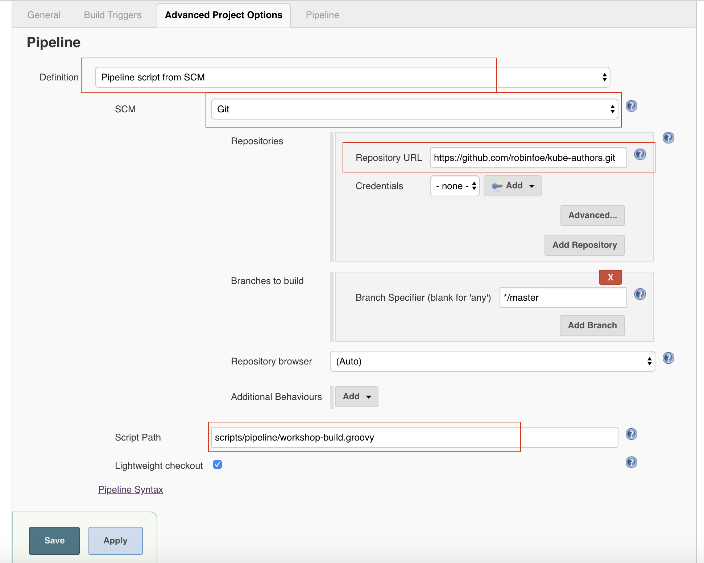

# Blue Green deployment with Kubernetes
This repository holds a setup script that allows you to perform blue/green deployments on a Kubernetes cluster ( minikube ). 

# Pre-requisite
I assume user have the following
- Kubernetes Cluster ( this repo is tested againts minikube v1.6.2)
- helm v.3.0.3

> [!NOTE]
> **For minikube environment, i have configured dnsmasq that point to nginx ingress with suffix .mkube**

# Description
The repo use the following tech stack
- [Jenkins ( from helm stable/jenkins v1.9.16)](https://hub.helm.sh/charts/stable/jenkins)
- [kaniko container v0.16.0](https://github.com/GoogleContainerTools/kaniko) 
- [kubectl container](https://www.google.com/search?q=google+cloud+builder+kubectl&rlz=1C5CHFA_enSG883SG883&oq=google+cloud+builder+kubectl&aqs=chrome..69i57j0j69i64j69i60l2.6264j0j7&sourceid=chrome&ie=UTF-8)

The script will setup the below url 
- http://jenkins.mkube - access to jenkins console
- http://dashboard.mkube - access to kubernetes console
- http://authors.mkube - access to Authors app Blue zone
- http://smoke.authors.mkube - access to Authors app Green zone

# Setup

Clone this repository by running the below command 

    ## shell
    git clone https://github.com/robinfoe/kube-authors.git

## Start minikube
    
    ## Run the following command
    
    minikube start  --vm-driver=vmwarefusion --cpus=6 --memory='8192' --disk-size='40000mb' 

    minikube addons enable ingress

    minikube addons enable dashboard

## Deploy Dashboard Ingress
    ## Navigate to kube-authors folder 
    cd %{WORKSPACE_HOME}/kube-authors/ 

    ## Run the command below 
    kubectl apply -f scripts/kube/ingress/ing-dashboard.yaml -n kubernetes-dashboard
    
## Deploy Sample Blue Green

##### Create namespace 
    kubectl create namespace workshop 

    kubectl config set-context --current --namespace=workshop

##### Deploy Jenkins with helm
    helm install hl-jenkins stable/jenkins  --set rbac.create=false --set master.usePodSecurityContext=false --set master.adminPassword=password

    kubectl apply -f scripts/kube/ingress/ing-jenkins.yaml -n workshop
    

##### Create Kaniko Config map for docker push 
    kubectl apply -f scripts/kube/configmap/cm-docker-kaniko.yaml -n workshop

##### Create RBAC for Jenkins and kubectl container

    kubectl apply -f scripts/kube/role/role-cluster-admin-jenkins.yaml 
    
    kubectl apply -f scripts/kube/role/role-cluster-admin-default.yaml 

##### Deploy App yaml

    ## Blue app
    kubectl apply -f scripts/kube/app/deployment-authors-blue.yaml
    kubectl apply -f scripts/kube/app/ing-authors.yaml
    kubectl apply -f scripts/kube/app/svc-authros-blue.yaml

    ## scale down blue to 0
    kubectl scale --replicas=0 deployment authors-blue

    ## Green app
    kubectl apply -f scripts/kube/app/deployment-authors-green.yaml
    kubectl apply -f scripts/kube/app/ing-authors-smoke.yaml
    kubectl apply -f scripts/kube/app/svc-authros-green.yaml

    ## scale down green to 0
    kubectl scale --replicas=0 deployment authors-green

##### Configure Jenkins for CI/CD pipeline
Navigate to jenkins console ( http://jenkins.mkube ) , create a new pipepine job as per below

and in jenkins setup
- Definition : Pipeline script from SCM
- SCM: git
- repositories: https://github.com/robinfoe/kube-authors.git
- Scripts path : scripts/pipeline/workshop-build.groovy

